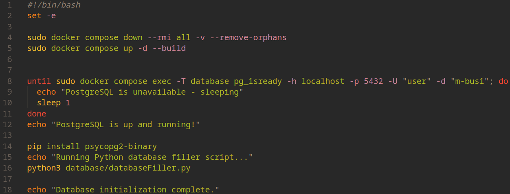
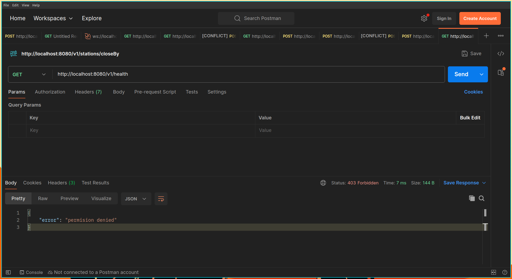
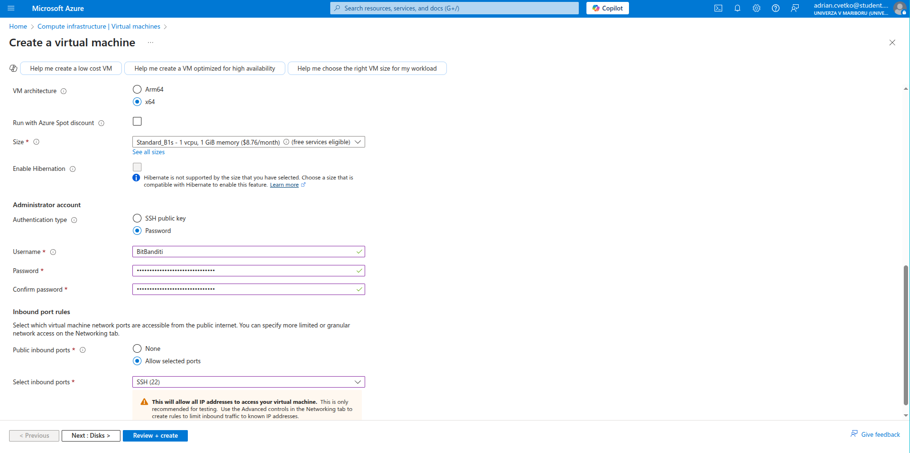
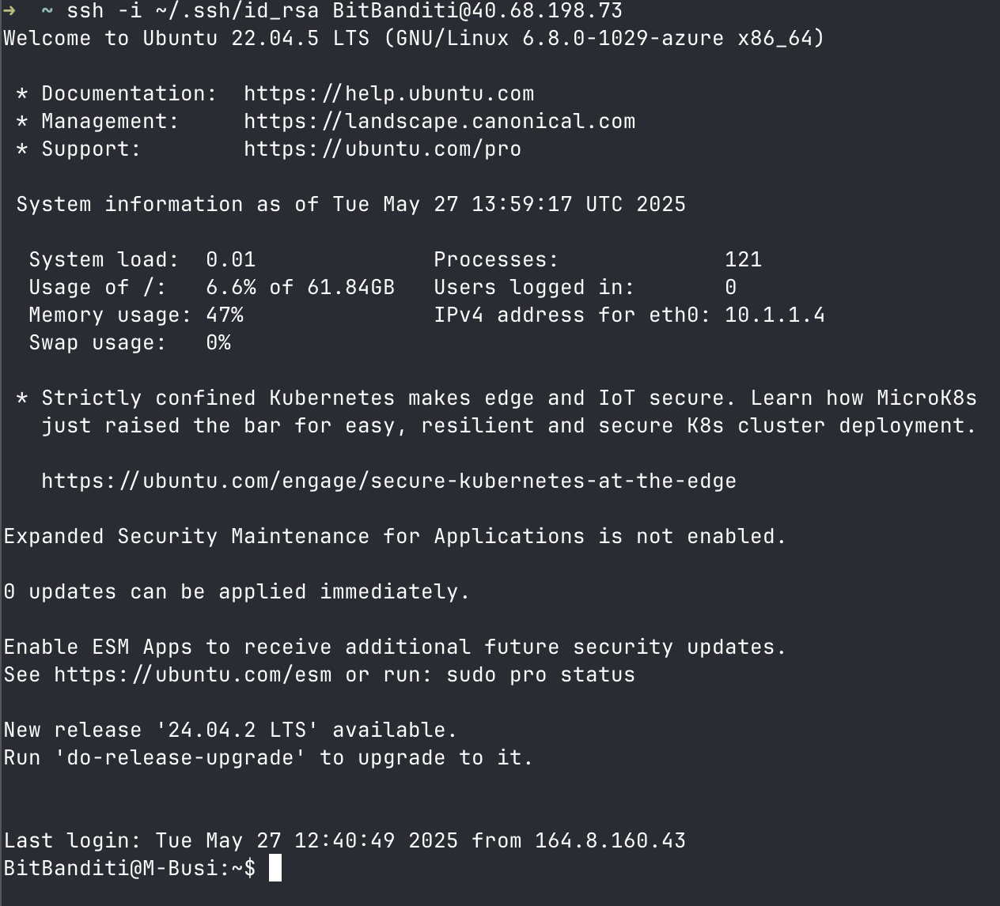
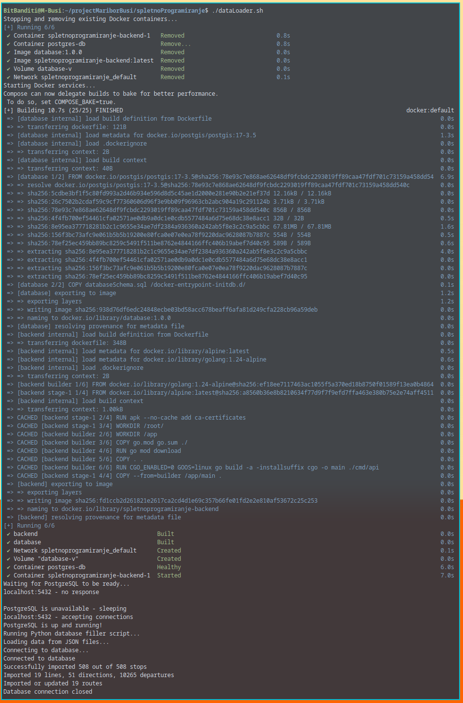

# 2. Projektna naloga - Azure

## "Deploying" v Dockerju
Naša spletna storitev, ki je rezultat prve projektne naloge pri predmetu Spletno programiranje temelji na zalednem delu celotnega projekta in podatkovne baze. 

Zaledni del je napisan v programskem jeziku GO, za katerega smo se odločili zaradi zelo široke podpore za razvoj spletnih tehnologij in tudi hitrosti, saj nameravamo v ozadju vedno opravljati simulacijo trenutnega stanja avtobusnega prometa po mariboru.

Pri podatkovni bazi smo se odločili za PostgreSQL, saj nam je bolj všeč kot MySQL, je zelo učinkovita podatkovna baza in ponuja zelo zmogljive funkcije skozi razližne knjižnice in razširitvene programe. 

Direktorij za našo spletno storitev izglelda nekako tako:


Kot je iz slike že razvidno, smo se odločili, da bomo v obeh glavnih direktorijih za našo spletno storitev uprabili Dockerfile, kasneje pa v starševskem direktorju *docker-compose.yml* datoteko, ki nam omogoča, da vse skupaj zaženemo naenkrat s poljubnimi parametri. Potrebni paketi/programi za zagon in uporabo Dockerja in Docker Compose sta Docker in Docker Compose.

V nadaljevanju bosta razloženi obe Dockerfile datoteki in Docker compose datoteka ter tudi avtomatizacijska skripta, s katero avtomatiziramo "deployment" naše spletne storitve.

### Dockerfile zalednega dela
V tem delu se bomo fokusirali na Dockerfile, ki se nahaja v direktoriju zalednega GO programa. Izgleda tako:


Ta Dockerfile definira večstopenjski proces za izgradnjo in pakiranje GO aplikacije v majhno Docker sliko. Začne se z gradbeno fazo, kjer uporablja golang:1.24-alpine kot osnovno sliko. V tej fazi se v delovnem imeniku /app najprej skopirata datoteki go.mod in go.sum, ki vsebujeta odvisnosti projekta. 

Z ukazom go mod download se nato prenesejo vse potrebne odvisnosti. Sledi kopiranje preostale izvorne kode aplikacije v delovni imenik. Ključni korak v tej fazi je prevajanje GO aplikacije z ukazom *go build.* Tukaj je pomembno, da se onemogoči CGO (CGO_ENABLED=0), kar zagotavlja, da je izvršljiva datoteka statično povezana in nima zunanjih odvisnosti, kar je idealno za Docker. Izvede se tudi specifikacija operacijskega sistema (GOOS=linux) in izhodno ime izvršljive datoteke, ki je poimenovana main in se nahaja v ./cmd/api.

Po uspešni gradbeni fazi sledi produkcijska faza, ki je zasnovana na majhni alpine:latest sliki. Ta faza se začne z namestitvijo ca-certificates z ukazom apk --no-cache add ca-certificates. To je ključno za zagotavljanje, da ima aplikacija znotraj kontejnerja potrebne certifikate za varno komunikacijo (npr. HTTPS klice). 

Nato se delovni imenik nastavi na /root/. Glavni del te faze je kopiranje zgrajene izvršljive datoteke main iz gradbene faze (--from=builder /app/main) v ta novi delovni imenik. Aplikacija bo poslušala na vratih 8080, kar je določeno z EXPOSE 8080. Nazadnje, CMD ["./main"] določa ukaz, ki se izvede ob zagonu kontejnerja, kar pomeni, da se bo aplikacija main zagnala takoj, ko se kontejner zažene.

### Dockerfile zalednega dela
V tem delu se bomo fokusirali na Dockerfile, ki se nahaja v direktoriju podatkovne baze. Izgleda tako:


Ta je veliko bolj preprost, saj se večino korakov za bazo zgodi kasneje Docker Compose datoteki. 

Začne se z FROM postgis/postgis:17-3.5, kar pomeni, da kot osnovno sliko uporablja uradno Docker sliko za PostGIS različice 17 s komponentami PostGIS 3.5. Ta slika že vsebuje PostgreSQL strežnik z nameščenimi razširitvami PostGIS.

Nato COPY databaseSchema.sql /docker-entrypoint-initdb.d/ skopira datoteko databaseSchema.sql v specifično pot /docker-entrypoint-initdb.d/ znotraj kontejnerja. To je posebna lokacija, ki jo Dockerjeve slike, zgrajene na osnovi uradne slike PostgreSQL (in PostGIS), prepoznajo. DatabaseSchema.sql je ena od naših datotek, ki defeinirajo podatkovno bazo. V tej spefični datoteki se definirajo tabele in njihovi atributi.

Ko se kontejner prvič zažene in inicializira bazo podatkov, bo samodejno izvedel vse .sql skripte, ki se nahajajo v tem imeniku. Torej, v tem primeru bo databaseSchema.sql.

### Docker Compose datoteka v starševskem direktoriju
Datoteka *docker-compose.yml* izgleda tako:

 

Ta *docker-compose.yml* datoteka definira dva dela: "database" in "backend", ki skupaj tvorita preprosto spletno storitev.

Najprej je definiran "database" del, ki temelji na Dockerfileu v mapi ./database. Poimenuje se `postgres-db` in uporablja sliko database:1.0.0, ki se zgradi iz podanega konteksta. Konfigurira se z okoljskimi spremenljivkami za ime baze podatkov ("m-busi"), uporabniško ime ("user") in geslo ("password"). Pomembno je, da se trajni nosilec z imenom "database-v" (definiran pod volumes na najvišji ravni) pritrdi na /var/lib/postgresql/datatest123412 (to ime je zgolj samo zdaj v obdobju testiranja) znotraj kontejnerja, kar zagotavlja, da so podatki baze persistentni in se ne izgubijo ob ponovnem zagonu. Vrata 5432 so preslikana med gostiteljem in kontejnerjem, kar omogoča dostop do baze. Storitev se bo vedno poskusila znova zagnati (restart: always), vključuje pa tudi healthcheck, ki preverja, ali je baza podatkov pripravljena za sprejemanje povezav vsakih 5 sekund.

Drugi del je "backend", ki se zgradi iz Dockerfilea v mapi ./backend. Ta storitev posluša na vratih 8080. Definira okoljsko spremenljivko DATABASE_URL, ki zalednemu delu omogoča povezavo z bazo podatkov (uporablja ime storitve database kot gostitelja, kar je omogočeno z Dockerjevo notranjo DNS konfiguracijo). Ključno je pogoj "service_healthy", kar pomeni, da se backend ne bo zagnal, dokler "healthcheck" baze podatkov ne sporoči, da je ta pripravljena. "Backend" se bo poskusil znova zagnati le ob napaki (restart: on-failure). Celoten sistem je zasnovan tako, da zagotavlja pravilno zaporedje zagona in robustnost ob morebitnih napakah.

### Python skripta za polnjenje baze
Ko se baza inicializira, se zažene Python skripta, ki vzame podatke v JSON obliki in napolni bazo z le temi. Spremeni tudi določene tabele, da kasneje na teh lahko izvajamo geolokacijske poizvedbe s pomočjo PostGIS. Ne bomo se preveč poglabljali v podrobnosti te skripte, izgleda tako:

```python
import json
import psycopg2
import re
from datetime import datetime

DB_PARAMS = {
    'host': 'localhost', 
    'port': 5432,         
    'database': 'm-busi',
    'user': 'user',
    'password': 'password'
}
def connectToDb():
    try:
        conn = psycopg2.connect(**DB_PARAMS)
        return conn
    except psycopg2.Error as e:
        print(f"Database connection error: {e}")
        exit(1)

def fixJsonFormat(jsonStr):
    if not jsonStr.strip().startswith('['):
        jsonStr = '[' + jsonStr
    
    if not jsonStr.strip().endswith(']'):
        jsonStr = jsonStr + ']'
    
    jsonStr = re.sub(r'}\s*{', '},{', jsonStr)
    
    return jsonStr

def loadJsonData(filePath):
    try:
        with open(filePath, 'r', encoding='utf-8') as file:
            content = file.read()
            content = fixJsonFormat(content)
            return json.loads(content)
    except (json.JSONDecodeError, FileNotFoundError) as e:
        print(f"Error loading JSON from {filePath}: {e}")
        return []

def importStops(conn, stopData):
    cursor = conn.cursor()
    success_count = 0
    
    for stop in stopData:
        try:
            cursor.execute(
                """
                INSERT INTO stops (id, number, name, latitude, longitude)
                VALUES (%s, %s, %s, %s, %s)
                ON CONFLICT (id) DO UPDATE 
                SET number = EXCLUDED.number,
                    name = EXCLUDED.name,
                    latitude = EXCLUDED.latitude,
                    longitude = EXCLUDED.longitude
                """,
                (int(stop['id']), stop['number'], stop['name'], stop['latitude'], stop['longitude'])
            )
            conn.commit()
            success_count += 1

        except KeyError as e:
            conn.rollback()
            print(f"Missing key in stop data: {e}, stop: {stop}")
        except Exception as e:
            conn.rollback()
            print(f"Error importing stop {stop.get('id', 'unknown')}: {e}")
    
    print(f"Successfully imported {success_count} out of {len(stopData)} stops")


def importDepartures(conn, arrivalData):
    """Import arrivals/departures data into the database"""
    cursor = conn.cursor()
    

    lines_count = 0
    directions_count = 0
    departures_count = 0
    
    for stop_info in arrivalData:
        stop_id = stop_info.get('id')
        departures = stop_info.get('departures', [])
        
        if not stop_id or not departures:
            continue
        
        for departure_info in departures:
            line_code = departure_info.get('line')
            direction_name = departure_info.get('direction')
            times = departure_info.get('times', [])
            
            if not line_code or not direction_name:
                continue
            
            try:
                cursor.execute(
                    """
                    INSERT INTO lines (line_code)
                    VALUES (%s)
                    ON CONFLICT (line_code) DO NOTHING
                    RETURNING id
                    """,
                    (line_code,)
                )
                
                result = cursor.fetchone()
                
                
                if result:
                    line_id = result[0]
                    lines_count += 1
                else:
                    cursor.execute("SELECT id FROM lines WHERE line_code = %s", (line_code,))
                    line_id = cursor.fetchone()[0]

                conn.commit()
                
                cursor.execute(
                    """
                    INSERT INTO directions (line_id, name)
                    VALUES (%s, %s)
                    ON CONFLICT (line_id, name) DO NOTHING
                    RETURNING id
                    """,
                    (line_id, direction_name)
                )
                
                result = cursor.fetchone()
                
                
                if result:
                    direction_id = result[0]
                    directions_count += 1
                else:
                    cursor.execute(
                        "SELECT id FROM directions WHERE line_id = %s AND name = %s",
                        (line_id, direction_name)
                    )
                    
                    direction_id = cursor.fetchone()[0]
                    
                conn.commit()
                for time_str in times:
                    cursor.execute(
                        """
                        INSERT INTO departures (stop_id, direction_id, departure)
                        VALUES (%s, %s, %s)
                        ON CONFLICT DO NOTHING
                        """,
                        (stop_id, direction_id, time_str)
                    )
                    conn.commit()
                    departures_count += 1
                
            except Exception as e:
                print(f"Error importing departure for stop {stop_id}, line {line_code}: {e}")
    
    
    print(f"Imported {lines_count} lines, {directions_count} directions, {departures_count} departures")

def importRouteData(conn, routeData):

    cursor = conn.cursor()
    imported = 0

    for item in routeData:
        try:
            route_name = item['route']      
            path_list  = item.get('path', [])  
            if not path_list:
                print(f"Skipping empty path for route {route_name}")
                continue

  
            cursor.execute(
                "SELECT id FROM lines WHERE line_code = %s",
                (route_name,)
            )
            row = cursor.fetchone()
            if row:
                line_id = row[0]
            else:
                cursor.execute(
                    "INSERT INTO lines (line_code) VALUES (%s) RETURNING id",
                    (route_name,)
                )
                line_id = cursor.fetchone()[0]
            conn.commit()  

            cursor.execute(
                """
                INSERT INTO public.routes (name, path, line_id)
                VALUES (%s, %s::jsonb, %s)
                ON CONFLICT ON CONSTRAINT uq_routes_name_line
                  DO UPDATE SET path = EXCLUDED.path
                """,
                (route_name, json.dumps(path_list), line_id)
            )
        except KeyError as e:
            conn.rollback()
            print(f"Missing key {e} in route item: {item}")
        except Exception as e:
            conn.rollback()
            print(f"Error importing route {item.get('route', '<unknown>')}: {e}")
        else:
            conn.commit()
            imported += 1

    print(f"Imported or updated {imported} routes")

def lastAlterScript (conn):
    try:
        cursor = conn.cursor()

        cursor.execute(
            "ALTER TABLE public.stops ADD COLUMN IF NOT EXISTS geom geography(Point, 4326);"
        )

        conn.commit()

        cursor.execute(
            """
            UPDATE public.stops
            SET geom = ST_SetSRID(ST_MakePoint(longitude::double precision, latitude::double precision), 4326)::geography
            WHERE geom IS NULL;
            """
        )

        conn.commit()

        cursor.execute(
            """
            CREATE INDEX IF NOT EXISTS stops_geom_idx ON public.stops USING GIST (geom);
            """
        )

        conn.commit()
    except KeyError as e:
            conn.rollback()
            print(f"Error: {e}")

def main():
    stopsFile = 'sharedLibraries/bus_stops_maribor2.json'
    arrivalsFile = 'sharedLibraries/bus_arrival_times_stops_maribor.json'
    routesFile = 'sharedLibraries/routes_maribor.json'
    
    # print(f"Starting import at {datetime.now()}")
    
    print("Loading data from JSON files...")
    stopsData = loadJsonData(stopsFile)
    arrivalsData = loadJsonData(arrivalsFile)
    routesData = loadJsonData(routesFile)
    
    print("Connecting to database...")
    conn = connectToDb()

    if conn:
        print("Connected to database")
    else:
        print("Error connecting to database")
        exit(1)
    
    
    try:
        importStops(conn, stopsData)
        importDepartures(conn, arrivalsData)
        importRouteData(conn, routesData)
        lastAlterScript(conn)
        
    except Exception as e:
        print(f"Error during import: {e}")
    finally:
        conn.close()
        print("Database connection closed")


if __name__ == "__main__":
    main()
```

Najprej skripta prebere podatke iz JSON datotek, ki so pridobljene s pomočjo naših spletnih strgalnikov in se nahajajo v skupni mapi za skupne datoteke. Trenutno v fazi testiranja se ta datoteka nahaja še kar v tem direktoriju za spletno storitev, ampak kasneje bo to posebej odsek za sebe v projektu.

Za tem se poskuša povezato na podatkovno bazo. Če je to neuspešno, se izvajanje skripte zaključi. 

Na koncu pa se pokličejo funkcije za delanje z bazo. Prvo se v bazo vstavijo podatki o avtobusnih postajah, potem o prihodih/odhodih avtobusov na postajah, na koncu pa še se napolnijo ostale tabele in vmesne tabele, najpomembneje tabela z geolokacijskimi podatki za avtobusne linije. 

Na koncu se še pokliče funckija, kjer je prisotnih nekaj "ALTER TABLE" stavkov, ki nam potem omogočijo uporabo geolokacijskih poizvedb. 

Ta skripta se zažene po inicializaciji in zagonu podatkovne baze zalednega dela spletne storitve, kar pa je določeno v glavni avtomatizacijski skrpti.

### Glavna avtomatizacijska skripta
Da nam je celoten postopek grajenja, zaganjanja in inicializiranja spletne storitve lažji, smo se odločili, da bomo vse skupaj izvajalli z avtomatizacijsko skrpto "dataLoader.sh". Trenutno je zelo preprosta, kasneje še nameravamo implementirati funkcionalnost za zagon naših strgalnikov, da bomo vedno imeli aktualne podatke avtobusnega prometa ter še tudi kaj podobnega. 

Skripta izgleda takole:



Skripta se začne z set -e, kar zagotavlja, da se bo skripta takoj ustavila, če pride do kakršne koli napake v izvajanju ukazov.

Nato z ukazom `sudo docker compose down --rmi all -v --remove-orphans` počisti prejšnje Docker Compose okolje. To pomeni, da ustavi in odstrani vse storitve, izbriše vse slike (--rmi all), odstrani vse nosilce (-v) in počisti morebitne nepotrebne kontejnerje, ki niso več del trenutne konfiguracije. To zagotavlja čist začetek.

Sledi `sudo docker compose up -d --build`, ki zažene Docker Compose storitve v ozadju (-d) in jih ponovno zgradi (--build) iz njihovih Dockerfile konfiguracij.

Po zagonu storitve se skripta prepriča, da je baza podatkov pripravljena. Z `until sudo docker compose exec -T database pg_isready -h localhost -p 5432 -U "user" -d "m-busi"; do ...` čaka, dokler PostgreSQL ni popolnoma zagnana in pripravljena sprejemati povezave. Ukaz `pg_isready` preverja stanje baze, skripta pa vsako sekundo ponovi preizkus, dokler ne uspe.

Na koncu skripta pripravi in zažene skripto za polnjenje baze podatkov, ki je predstavljena zgoraj. Najprej namesti modul psycopg2-binary, nato pa Python skripto, ki napolni bazo s podatki iz JSON datotek.

Celotna skripta avtomatizira ponoven zagon celotnega razvojnega okolja, zagotavlja, da so vsi servisi pravilno zagnani in da je baza podatkov inicializirana s potrebnimi podatki. Zagotavlja tudi, da jo lahko zaganja samo administrator oz. pooblaščena oseba, ki lahko zaganja ukaze s "sudo" privilegiji.

### Demonstracija "deploymenta" in delovanja spletne storitve

#### Prikaz delovanja avtomatizacijske skripte

Za "deployment" je potrebno samo v starševskem direktoriju zagnati našo avtomatizacijsko skripto, kar pa izgleda takole:


Trajanje izvajanja je odvisno od zmogljivosti sistema, ampak ponavadi ne traja dlje kot kakšno minuto. Ko se ta skripta zaključi, se v ozadju izvaja naša spletna storitev z napolnjeno podatkovno bazo in do te lokalne storitve dostopamo z naslovom  `http://localhost:8080`

#### Demonstracija delovanja spletne storitve

Za demonstracijo delovanja spletne storitve bomo uporabili program Postman in bomo predstavili delovanje dveh API "endpointov". 

Najprej poizvedba po "zdarvju" storitve, kar pridobimo z GET poizvedbo `http://localhost:8080/v1/health`. Odgovor s strani storitve mora biji "permision denied", saj le avtorizirani uporabniki lahko vidijo stanje delovanja spletne storitve in določene zaupne podatke.



Iz slke je razvidno, da smo res naredili GET poizvedbo `http://localhost:8080/v1/health` in da je odgovor res bil "permision denied", tudi vrnjena koda stanja je "403 Forbidden".

Za drugi del demonstracije pa bomo pokazalo POST poizvedbo `http://localhost:8080/v1/stations/closeBy`, kjer telo poizvedbe opremimo z podatki uporabnikove lokacije in velikosti območja, v katerem želi doiti prikaz vseh avtobusnih postaj. 


Iz slke je razvidno, da smo res naredili `http://localhost:8080/v1/stations/closeBy` in da je odgovor res bil v JSON obliki, kjer so definirani podatki o avtobusnih postajah, kot je  npr. ID postaje, ime postaje itd. To je tudi primer geolokacijske poizvedbe, ki je izvedena s pomočjo PostGIS. 

<br>

## Vzpostavitev Linux virtualne naprave na Azure

### Prikaz vzpostavitve virtualne naprave
Za vzpostavitev virtualne naprave smo se držali smernic, ki so zapisane na spletni učilnici. Za "Resource group" smo nastavili ime naše skupine, ime virtualne naprave pa smo nastavili enako kot ime našega projekta. Kongfiguracija izgleda takole:




Pregled nad našo virtualno napravo izgleda tako:


Tukaj še je prikaz dostopa do virtualne naprave s strani vodje skupine in izvršitve ukaza `ls` za demonstracijo:


### Prikaz zagotovitve SSH dostopa vseh članov 

Za omogočanje SSH dostopa vseh članov smo se odločili za uporabo SSH ključev. 

Najprej je vsak član generiral par javnega in zasebnega ključa:


Potem je vodja skupine zbral javne kljče vseh članov in jih dodal na virtualno napravo v datoteko `~/.ssh/authorized_keys`. Na slikah je sicer to prikazano samo za enega člana, ampak smo kasneje to naredili za vse tri člane skupine. 


Nato še je vodja skupine nastavil pravilna dovoljenja za ustvarjeno datoteko in `.ssh` direktorij:


Zdaj pa še prikaz SSH dostopa vsakega člana s svojimi SSH ključi.

Adrian Cvetko:


Timotej Maučec:



Blaž Kolman:


Iz slik je razvidno, da je vsak član skupine za prijavo uporabil svoj zaseben SSH ključ in ni rabil posebej vnašti gesla, ki je bilo definirano ob ustvarjanju virtualne naprave, za prijavo. 

### Odgovori na vprašanja
`Kje in kako omogočite "port forwarding"?` <br>
Najprej odpremo našo virtualno napravo. Potem gremo pod "Network settings":


Potem gremo pod sekcijo "Rules", kjer so navedena vsa dovoljena dohodna vrata:


Za dodajanje novih vrat preprosto kliknemo na gumb "Create port rule". Odpre se nam nova sekcija, kjer lahko določimo svoja pravila za nova vrata:


Določimo paramatre, ki nam ustrezajo. To so vir, destinacijo, protokol, dejanja, prioriteto, ime itd. 

`Kakšen tip diska je bil dodan vaši navidezni napravi in kakšna je njegova kapaciteta?` <br>
Najprej odpremo našo virtualno napravo. Tokrat gremo pod "Disks" v settings zavihku:


Tukaj lahko vidimo vse informacije o disku, ki je bil dodeljen naši virtualni napravi. Iz spodnje slike je razvidno, da je na naši virtualni napravi disk "M-Busi_disk1_20713facd9ff492581291dc5b43373a1" vrste *Premium SSD LRS* in velikost 64GB:


`Kje preverimo stanje trenutne porabe virov v naši naročnini ?` <br>

Najprej se pomaknemo na naš glaven dashboard in poiščemo "Cost managment":


Potem se na levem meniju pomaknemo v zahihek "Reporting + analytics" ter izberemo "Cost analysis": 


Izberemo našo naročnino in dobimo prikaz porabe virov:


<br>

## Vzpostavitev Dockerja in "deployment" spletne storitve na virtualni napravi
Za vzpostavitev Dockerja na naši Azure virtualni napravi smo sledili naslednjim korakom;
Najprej smo posodobili našo virtualno napravo:


Za tem smo namestili vse potrebne Docker pakete:


Potem pa smo s pomočjo "git clone" ukaza prenesli vse potrebne datoteke za zagon spletne storitve z Dockerjem na virtualni napravi. Prenesli smo samo relevantno vejo, kjer se nahaja spletna storitev in potrebne konfiguracijske datoteke za "deployment". 

```bash
git clone --branch SC-50-Izdelava-posredniške-storitve --single-branch https://github.com/projectBlockchainRIT/projectMariborBusi.git
```

Za tem smo se pomaknili v starševski direktorij spletne storitve:


Tukaj se nahaja naša "dataLoader.sh" skripta, ki je bila opisana v prvi sekciji tega poročila. Enako kot prej, je potreben samp zagon te skripte in bo spletna storitev pripravljena:



Za mogočanje javnega dostopa do aplikacije smo najprej odprli še port 8080, ker na tem portu deluje naša spletna storitev ter tudi port 80, ki odpira HTTP povezave:


Za tem pa smo še uporabili "Uncomplicated Firewall", kar je požarni zid že vgrajen v Ubuntu, da smo odprli vrata za SSH, za vrata 8080 in vrata 80. Vse ostali je zaprto. Na koncu pa smo požarni zid tudi omogočili:


### Demonstracija dostopa do storitve iz javnega omrežja

Enako kot pri demonstraciji za prvo sekcijo, bomo najprej demonstritali API "endpoint" za pregled stanja zdravja spletne storitve. Na spodni je spet Postman, ampak tokrat namesto "localhost" uporabljamo IP naslov naše virtualne naprave. Zraven postmana pa še prikazujem realnočasovna LOG datoteke za zaledni del na virtualni napravi, kjer se vidi stanje odzivanja. Pri GET poizvedbi `http://40.68.198.73:8080/v1/health` spet dobimo "Permission denied", kot tudi mora biti:


Kot drugi del demonstracije pa spet prikažemo POST poizvedno `http://40.68.198.73:8080/v1/stations/closeBy` z dodanim potrebnim telesom. Dobimo pravilen odziv s strani spletne storitve ter tudi na LOG poročilu se vidi, da je strežnik zabeležil uspešen odziv:


