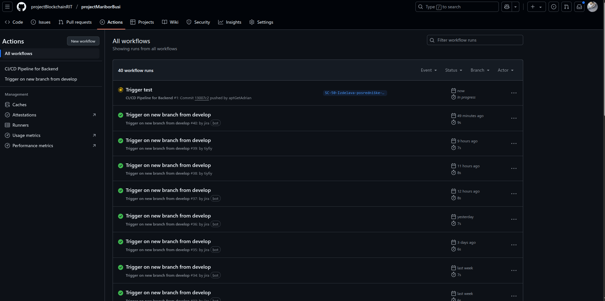
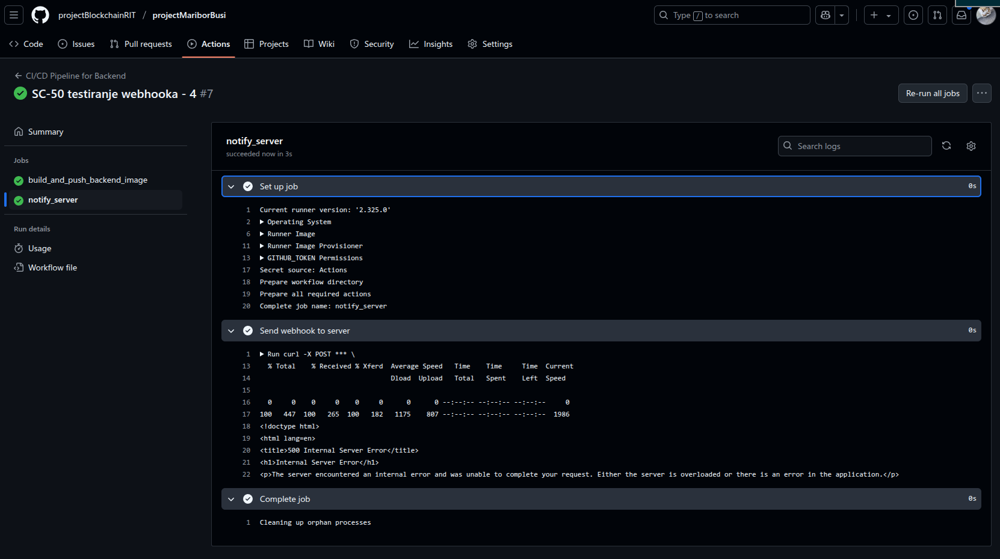

# 3. Projektna naloga - Azure, CI/CD

## Docker Hub Container Registry
Docker Hub nam je služil kot centralni register za shranjevanje naših Docker slik. V brezplačni različici omogoča en zasebni repozitorij, kar je za naše potrebe povsem zadostovalo. Naše Docker slike so predstavljale ključne komponente naše aplikacije: backend (Go aplikacija) in database (PostGIS).

Na Docker Hub smo dodali Docker sliki za backend in database komponenti naše aplikacije. To smo storili v dveh korakih: najprej lokalna izgradnja slike na našem razvojnem okolju, nato pa nalaganje te slike na Docker Hub.

### Priprava in prijava
Preden smo lahko karkoli naložili, smo se morali prijaviti v Docker Hub iz ukazne vrstice. To zagotavlja, da imamo potrebna dovoljenja za nalaganje (pushanje) slik v naš osebni repozitorij.
```bash
docker login
```

Med izvajanjem tega ukaza smo vnesli naše Docker Hub uporabniško ime in geslo ali pa smo uporabili enkratno prijavo s kodo za potrditvijo. S tem smo se avtenticirali in omogočili nadaljnje operacije:


### Izgradnja Docker slike za Backend
Naša backend aplikacija je napisana v Go-ju in je imela svoj Dockerfile v mapi ./backend (to smo prikazali že v prejšnjem poročilu). Za izgradnjo Docker slike smo uporabili ukaz `docker build`. 

Uporabili smo format `<VAŠE_DOCKER_USERNAME>/backend:latest`, kar pomeni, da bo slika shranjena v našem osebnem repozitoriju pod imenom backend z oznako latest. Kontekst `./backend` pa je Dockerju povedal, kje naj išče Dockerfile in ostale potrebne datoteke:


Ko je bila slika uspešno zgrajena, smo jo naložili na Docker Hub z ukazom docker push. Ta ukaz je sliko prenesel iz našega lokalnega okolja v naš oddaljeni repozitorij na Docker Hubu.


Enako smo naredili tudi za podatkovno bazo.


Docker Hubu to izgleda tako:


<hr>
<br>

## GitHub Actions Workflows: Avtomatizacija CI/CD procesa

### Nastavitev GitHub Secrets

GitHub Actions nam je omogočil avtomatizacijo našega CI/CD procesa. Vse delo je bilo definirano v YAML datoteki (`ci-cd.yml`), ki se nahaja v mapi `.github/workflows` v našem Git repozitoriju. Ta datoteka definira vrsto opravil, ki se samodejno sprožijo ob določenih dogodkih, kot je push na določeno vejo.

Preden smo definirali delovni tok, smo morali varno shraniti občutljive podatke, kot so naše Docker Hub poverilnice in URL webhooka. To smo storili z uporabo GitHub Secrets.

V našem GitHub repozitoriju smo šli na `Settings` -> `Secrets and variables` -> `Actions`.


Dodali smo naslednje skrivnosti:
- `DOCKER_USERNAME`: Naše Docker Hub uporabniško ime.
- `DOCKER_PASSWORD`: Naše Docker Hub geslo.
- `WEBHOOK_URL`: Javni URL našega Azure VM, ki sprejema webhooke (npr. http://<JAVNI_IP_VAŠEGA_VM>:8080/webhook).
- `WEBHOOK_SECRET`: Varni niz znakov, ki smo ga ustvarili in ki bo uporabljen za preverjanje avtentičnosti webhook sporočil.


### Implementacija Osnovnega CI/CD Workflowa

Naš glavni ci-cd.yml delovni tok je odgovoren za izgradnjo in nalaganje backend Docker slike ter nato za obveščanje našega strežnika prek webhooka. Izgleda tako:

```yml
name: CI/CD Pipeline for Backend

on:
  push:
    branches:
      - SC-50-Izdelava-posredniške-storitve
    paths:
      - "spletnoProgramiranje/backend/**"

jobs:
  build_and_push_backend_image:
    runs-on: ubuntu-latest
    steps:
      - name: Checkout code
        uses: actions/checkout@v4

      - name: Login to Docker Hub
        uses: docker/login-action@v3
        with:
          username: ${{ secrets.DOCKER_USERNAME }}
          password: ${{ secrets.DOCKER_PASSWORD }}

      - name: Build and push Backend Docker image
        uses: docker/build-push-action@v5
        with:
          context: ./spletnoProgramiranje/backend
          push: true
          tags: ${{ secrets.DOCKER_USERNAME }}/backend:latest

  notify_server:
    needs: build_and_push_backend_image
    if: success()
    runs-on: ubuntu-latest
    steps:
      - name: Send webhook to server
        run: |
          curl -X POST ${{ secrets.WEBHOOK_URL }} \
            -H "Content-Type: application/json" \
            -H "X-GitHub-Event: deployment" \
            -H "X-Hub-Signature: ${{ secrets.WEBHOOK_SECRET }}" \
            -d '{
              "event": "new_backend_image",
              "repository": "${{ github.repository }}",
              "tag": "latest",
              "commit_sha": "${{ github.sha }}"
            }'
```

Ko se zazanajo spremembe, workflow izvede več korakov. Najprej klonira trenutno stanje repozitorija v GitHubovem CI okolju. Nato se prijavi v Docker Hub s pomočjo prijavnih podatkov, shranjenih varno v GitHub Secrets (okoljski spremenljivki `DOCKER_USERNAME` in `DOCKER_PASSWORD`). Po uspešni prijavi zgradi Docker sliko backend aplikacije ter jo označi in objavi v Docker Hub z oznako latest.

Če ta proces uspe, se izvede drugi del workflowa – pošiljanje webhook obvestila na zunanji strežnik. To obvestilo vsebuje osnovne informacije o dogodku (ime repozitorija, oznako slike, commit SHA), ki jih strežnik lahko uporabi za sprožitev nadaljnjih postopkov, kot je npr. avtomatska namestitev ali posodobitev storitev. `Webhook` zahteva tudi podpis (X-Hub-Signature), kar omogoča strežniku, da preveri avtentičnost zahteve in zaščiti sistem pred nepooblaščenimi poskusi.

Po tem, ko smo datoteko `ci-cd.yml` dodali v repozitorij in jo potisnili na GitHub, smo sprožili prvi zagon delovnega toka z majhno spremembo v mapi backend. Spremljali smo izvajanje v zavihku Actions na GitHubu.




### Dodatni GitHub Actions Workflows za Projekt

Poleg osnovnega CI/CD delovnega toka, ki avtomatizira izgradnjo in dostavo, bi lahko za naš projekt dodali več drugih GitHub Actions delovnih tokov za izboljšanje kakovosti kode, zanesljivosti in varnosti. Spodaj opisujemo 3 možne primere:

#### Code Quality & Linting Workflow
Ta delovni tok bi se sprožil ob vsakem pull requestu ali push ukazu na main vejo, pred dejansko izgradnjo Docker slike. Nahajal bi se v ločeni `.yaml` datoteki, npr. `.github/workflows/code-quality.yml`.

Zagotavlja, da je naša koda skladna s predpisanimi slogovnimi smernicami in da ne vsebuje očitnih napak ali potencialnih ranljivosti. To preprečuje, da bi slaba koda prišla v main vejo. Za naš Go backend bi uporabili `golangci-lint`.

```yml
name: Code Quality Checks (Backend)
on:
  pull_request:
    branches: [ main ]
    paths: [ 'backend/**' ]
  push:
    branches: [ main ]
    paths: [ 'backend/**' ]
jobs:
  lint:
    runs-on: ubuntu-latest
    steps:
      - name: Checkout code
        uses: actions/checkout@v4
      - name: Setup Go
        uses: actions/setup-go@v5
        with:
          go-version: '1.22'
      - name: Run golangci-lint
        working-directory: ./backend
        run: |
          curl -sSfL https://raw.githubusercontent.com/golangci/golangci-lint/master/install.sh | sh -s -- -b $(go env GOPATH)/bin v1.58.1
          $(go env GOPATH)/bin/golangci-lint run ./...
```

#### Vulnerability Scanning Workflow
Ta delovni tok bi se sprožil po uspešni izgradnji in naložitvi Docker slike na Docker Hub (npr. odvisen od `build_and_push_backend_image` joba). Nahajal bi se v `.github/workflows/vulnerability-scan.yml`.

Pregledal bi našo Docker sliko za znane varnostne ranljivosti v operacijskem sistemu in knjižnicah. To nam omogoča, da zgodaj odkrijemo in odpravimo morebitne varnostne pomanjkljivosti, preden slika doseže produkcijo. Uporabili bi orodja, kot je Aqua Security Trivy.

```yml
name: Docker Image Vulnerability Scan
on:
  push:
    branches: [ main ]
    paths: [ 'backend/**' ]
jobs:
  scan:
    runs-on: ubuntu-latest
    steps:
      - name: Checkout code
        uses: actions/checkout@v4
      - name: Scan Docker image with Trivy
        uses: aquasecurity/trivy-action@master
        with:
          image-ref: '<VAŠE_DOCKER_USERNAME>/backend:latest'
          format: 'table'
          severity: 'HIGH,CRITICAL'
          exit-code: '1'
```

#### Unit & Integration Tests Workflow
Ta delovni tok bi se prav tako sprožil ob pull requestu ali push ukazu na main vejo. Lahko bi se izvajal vzporedno z linterjem ali pa bi bil od njega odvisen. Nahajal bi se v `.github/workflows/tests.yml`.

Preveril bi funkcionalnost naše aplikacije z izvajanjem avtomatiziranih testov. Enotni testi preverjajo posamezne dele kode, integracijski testi pa preverjajo interakcijo med različnimi komponentami (npr. backend in baza podatkov).

```yml
name: Run Backend Tests
on:
  pull_request:
    branches: [ main ]
    paths: [ 'backend/**' ]
  push:
    branches: [ main ]
    paths: [ 'backend/**' ]
jobs:
  test:
    runs-on: ubuntu-latest
    steps:
      - name: Checkout code
        uses: actions/checkout@v4
      - name: Setup Go
        uses: actions/setup-go@v5
        with:
          go-version: '1.22'
      - name: Run Backend Unit Tests
        working-directory: ./backend
        run: go test -v ./...
```


<hr>
<br>

## Webhook: Komunikacija s strežnikom za avtomatizirano posodobitev

### Nastavitev Webhook sprejemnika na Azure VM
Nastavitev Webhook sprejemnika na Azure VM
Na našem Azure VM smo implementirali majhen spletni strežnik s pomočjo Python Flask ogrodja, ki je poslušal na določenem portu (8081) in sprejemal HTTP POST zahteve. Ta sprejemnik je služil kot vstopna točka za webhook sporočila iz GitHub Actions.

Ustvarili smo Python skripto `webhooklistener.py`. Ta skripta je odgovorna za sprejemanje POST zahtev na /webhook poti, preverjanje avtentičnosti in sprožitev skripte za posodobitev.

```python
import subprocess
import os
import hmac
import hashlib
from flask import Flask, request, abort

app = Flask(__name__)

DEPLOY_SCRIPT_PATH = "/home/BitBanditi/projectMariborBusi/spletnoProgramiranje/dataLoader.sh"
WEBHOOK_SECRET = os.environ.get("WEBHOOK_SECRET")

@app.route('/webhook', methods=['POST'])
def webhook():
    if request.method == 'POST':
        if WEBHOOK_SECRET:
            if 'X-Hub-Signature' not in request.headers:
                print("Error: X-Hub-Signature header missing.")
                abort(403) 

            signature = request.headers['X-Hub-Signature'].split('=')[1]
            payload = request.data

            mac = hmac.new(WEBHOOK_SECRET.encode('utf-8'), payload, hashlib.sha1)
            if not hmac.compare_digest(mac.hexdigest(), signature):
                print("Error: Invalid signature.")
                abort(403)
            print("Signature verified successfully.")
        else:
            print("Warning: WEBHOOK_SECRET not set, skipping signature verification.")


        print("Executing deploy script...")
        try:
            with open("/var/log/webhook_deploy.log", "a") as log_file:
                subprocess.Popen([DEPLOY_SCRIPT_PATH], stdout=log_file, stderr=subprocess.STDOUT)
            print("Deploy script launched successfully.")
            return 'Webhook received and deploy script launched!', 200
        except Exception as e:
            print(f"Error launching deploy script: {e}")
            return 'Failed to launch deploy script', 500
    else:
        return 'Method Not Allowed', 405

if __name__ == '__main__':
    print(f"Starting webhook listener on port 8081. WEBHOOK_SECRET set: {bool(WEBHOOK_SECRET)}")
    app.run(host='0.0.0.0', port=8081)
```

Ko prejmemo POST zahtevo na naslov /webhook, najprej preverimo, ali imamo nastavljeno okoljsko spremenljivko `WEBHOOK_SECRET`, ki jo uporabljamo za varnostno preverjanje avtentičnosti zahtev. S tem poskrbimo, da naš strežnik ne sprejema ukazov od nepovabljenih virov. V primeru, da je zahteva podpisana, jo s HMAC in SHA1 algoritmom primerjamo z dejanskim podpisom v glavi X-Hub-Signature. Če se podpisa ujemata, vemo, da zahteva res prihaja iz zaupanja vrednega vira – GitHub Actions.

Ko je podpis uspešno preverjen (ali če se odločimo, da ga ne preverjamo), nadaljujemo z zagonom namestitvenega skripta dataLoader.sh, ki se nahaja na absolutni poti na našem strežniku. Ta skript se zažene z uporabo modula subprocess, njegov izhod pa se zapiše v dnevnik `/var/log/webhook_deploy.log`, kar nam omogoča pregledovanje in odpravljanje napak, če gre karkoli narobe. Pomembno je, da ta skript ima ustrezna dovoljenja in po potrebi tudi sudo pravice.

Na koncu vrnemo HTTP odgovor glede na to, ali je bil skript uspešno zagnan ali ne. S to rešitvijo smo si omogočili avtomatsko odzivanje strežnika na spremembe v kodi – brez ročnega posredovanja – kar nam poenostavi razvoj, testiranje in nameščanje programske opreme.

Na Azure strežniku smo tudi odprli port 8081.


Za zagotavljanje, da se naš webhook listener samodejno zažene ob zagonu VM in ostane aktiven, smo ustvarili `systemd` storitev (`/etc/systemd/system/webhook.service`). Ta storitev je tudi varno nastavila okoljsko spremenljivko `WEBHOOK_SECRET`.


Po ustvarjanju datoteke smo znova naložili systemd konfiguracijo in omogočili/zagnali storitev.


Status in loge smo preverjali z `sudo systemctl status webhook.service` in `journalctl -u webhook.service -f`.


### Skripta za avtomatizirano posodobitev

Že pri prejšnji projektni nalogi smo imeli avtomatizacijsko skripto, ki je zagnala naše Docker kontainerje. Tokrat se ta skripta sproži avtomatsko, ko jo pokliče Python Webhook, ki je bil priazan. Zdaj smo to skripto prilagodili in izgleda tako:

```bash
#!/bin/bash
set -e

SCRIPT_DIR="$(cd "$(dirname "${BASH_SOURCE[0]}")" && pwd)"
cd "$SCRIPT_DIR"

DOCKER_USERNAME="a30drian"

sudo docker compose down --rmi all -v --remove-orphans

echo "Pulling latest backend image..."
docker pull ${DOCKER_USERNAME}/backend:latest

sudo docker compose up -d --build

until sudo docker compose exec -T database pg_isready -h localhost -p 5432 -U "user" -d "m-busi"; do
  echo "PostgreSQL is unavailable - sleeping"
  sleep 1
done
echo "PostgreSQL is up and running!"

echo "Running Python database filler script..."
python3 "$SCRIPT_DIR/database/databaseFiller.py"

echo "Database initialization complete."
```

Najprej določimo absolutno pot do direktorija, kjer se nahaja sama skripta, in se vanj tudi prestavimo. To poskrbi, da se vsi relativni ukazi kasneje izvajajo iz pravilnega direktorija, ne glede na to, od kod je bila skripta zagnana.

Sledi ukaz `sudo docker compose down`, ki poskrbi za odstranitev vseh obstoječih storitev, mrež, slik in volumenov – vključno z osirotelimi vsebinami. S tem poskrbimo za čisto okolje brez morebitnih preteklih konfliktov.

Nato potegnemo najnovejšo sliko backend servisa iz Docker Huba, kjer uporabimo uporabniško ime, definirano v spremenljivki `DOCKER_USERNAME`.

Ko je nova slika pripravljena, z `sudo docker compose up -d --build` ponovno zaženemo vse storitve v ozadju in po potrebi zgradimo lokalne slike (če so definirane v `docker-compose.yml` datoteki).

Ker je baza PostgreSQL ključna komponenta našega sistema, uporabimo pg_isready znotraj zagnanega kontejnerja, da preverimo, ali je baza dosegljiva. Zanka poskrbi, da čakamo, dokler baza ni popolnoma zagnana in pripravljena na sprejem povezav.

Na koncu, ko je baza podatkov dosegljiva, zaženemo Python skripto `databaseFiller.py`, ki se nahaja v poddirektoriju `database/`. 

<hr>
<br>

## Preizkus celotnega CI/CD delovnega toka

Končni korak je bil testiranje celotne verige:

- Naredili smo manjšo spremembo v kodi znotraj mape backend v našem Git repozitoriju.
- Spremembe smo potisnili na GitHub 
- GitHub Actions je samodejno sprožil delovni tok: zgradil je novo Docker sliko, jo naložil na Docker Hub in poslal webhook sporočilo na naš Azure VM.
- Na Azure VM je `webhookListener.py` sprejel sporočilo, preveril podpis in sprožil `dataLoader.sh` skripto.
- Skripta `dataLoader.sh` je prenesla najnovejšo backend sliko iz Docker Huba, ustavila stare kontejnerje in zagnala nove.
- Preverili smo, da se je naša aplikacija uspešno posodobila na VM.





## Varnostne luknje in odprava pri uporabi Webhooka

Za naš primer smo zaznali naslednje potencialne varnostne luknje:

### Neavtoriziran dostop / Ponarejanje sporočil (Spoofing):

- `Problem:` Kdorkoli, ki pozna naš `WEBHOOK_URL`, bi lahko poslal lažno sporočilo in s tem sprožil nepooblaščeno namestitev ali druge nezaželene akcije na našem strežniku.

- `Odprava:` Uporabili smo skrivni ključ in preverjanje podpisa (X-Hub-Signature). GitHub Actions ob pošiljanju webhooka izračuna HMAC SHA1 podpis celotnega sporočila z uporabo našega `WEBHOOK_SECRET` in ga vključi v glavo X-Hub-Signature. Naš `webhookListener.py` na strežniku nato izvede enak izračun in primerja svoj izračunani podpis s tistim, ki ga je prejel. Če se ne ujemata, je sporočilo zavrnjeno. To zagotavlja, da so sporočila poslana zgolj s strani avtoriziranega pošiljatelja.

### Man-in-the-Middle napadi

- `Problem:` Če uporabljamo HTTP za webhook komunikacijo, so sporočila poslana v odprtem tekstu, kar omogoča potencialnim napadalcem prisluškovanje in prestrezanje občutljivih podatkov ali celo spreminjanje vsebine sporočil med prenosom.

- `Odprava:` Najboljša praksa je uporaba HTTPS. To zagotavlja šifrirano komunikacijo med GitHub Actions in našim strežnikom, s čimer preprečimo prisluškovanje in MITM napade. Čeprav v tej specifični vaji za enostavnost morda uporabljamo HTTP, se zavedamo te ranljivosti.

### Privilege Escalation

- `Problem:` Skripta `dataLoader.sh`, ki se sproži ob webhooku, se izvaja z določenimi pravicami na VM. Če je ta skripta ranljiva (npr. izvaja ukaze na podlagi nepreverjenih vhodnih podatkov iz webhooka), bi napadalec lahko pridobil nadzor nad strežnikom.

- `Odprava:` 
  - `Minimalne pravice`: Webhook listener in `dataLoader.sh` skripta se izvajata pod uporabnikom z minimalnimi potrebnimi dovoljenji. Nebi uporabljali `sudo` znotraj `dataLoader.sh` za Docker ukaze, saj je uporabnik član docker skupine.
  - `Validacija vhodnih podatkov`: Čeprav v tej vaji payload ni bil uporabljen za izvajanje ukazov, bi v realnem scenariju vsak podatek iz payload-a pred uporabo temeljito validirali.

### DoS napadi

- `Problem:` Neprestano pošiljanje webhook sporočil (namerno ali nenamerno) bi lahko preobremenilo naš strežnik in povzročilo padec storitve.

- `Odprava:` v produkcijskem okolju to bi lahko: 
    - omejevali število zahtev na časovno enoto
    - postavili webhook listenerja za CDN ali DDoS zaščito
    - preverjali izvornih IP naslovov


