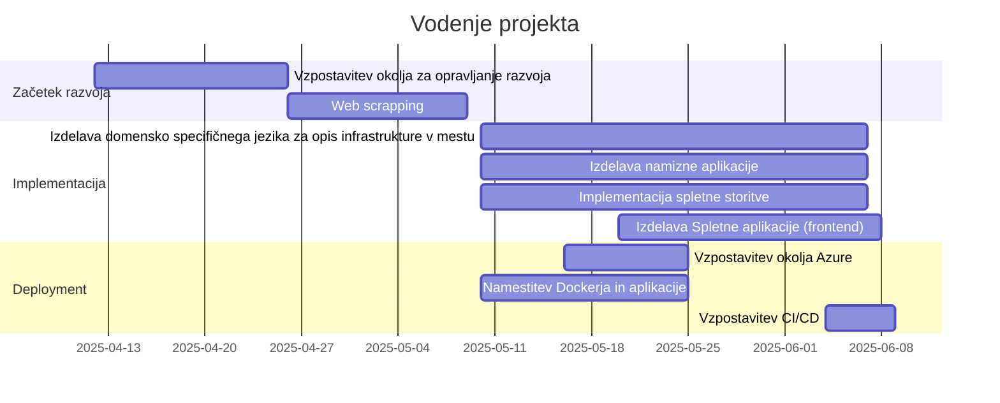
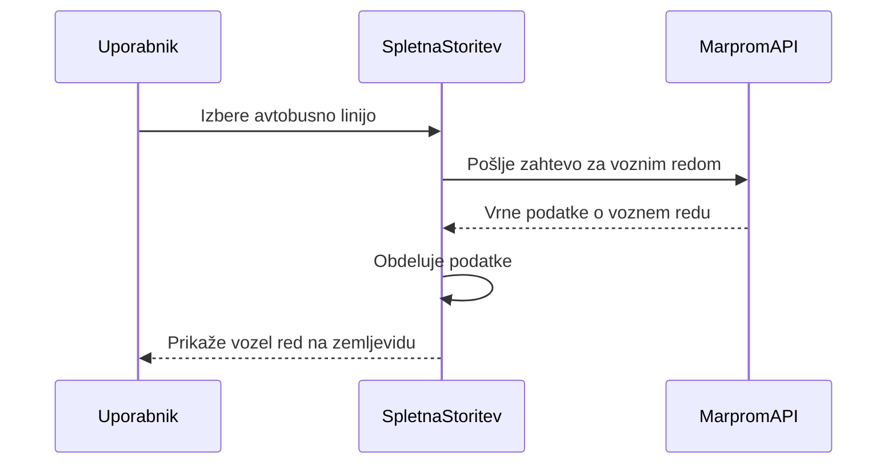
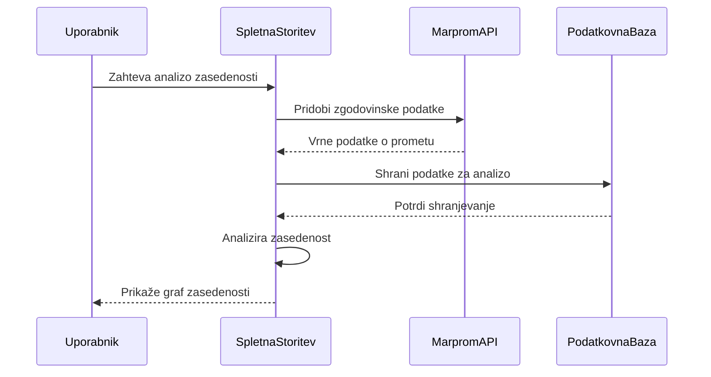
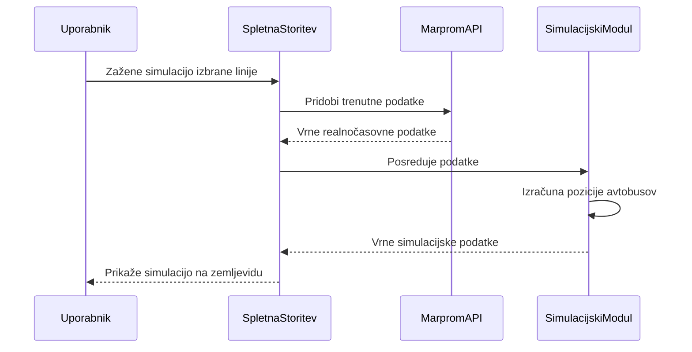
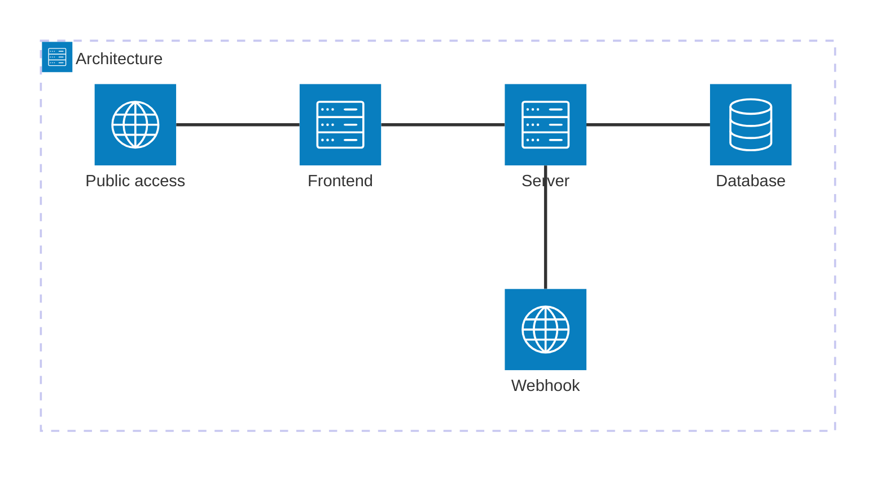
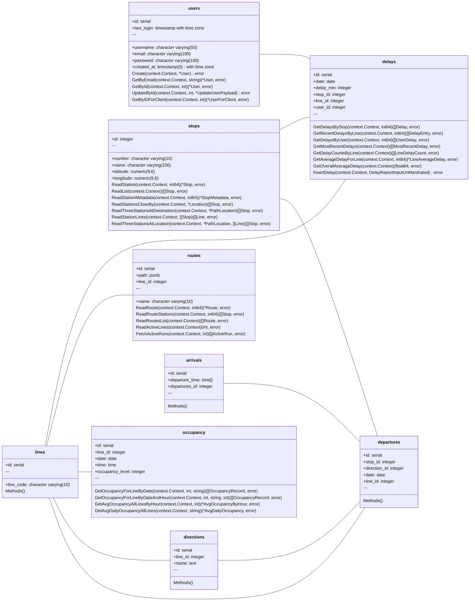
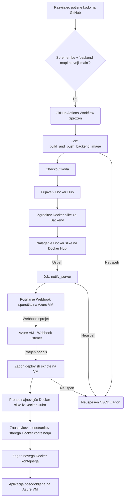
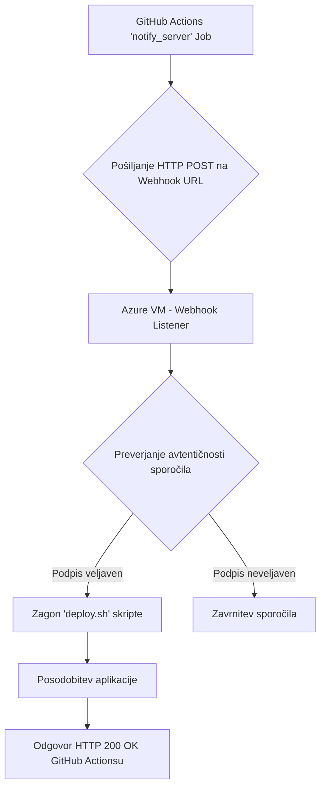

# Dokumentacija
#### Zaključna dokumentacija pri predmetu Sistemska administracija


## Prva stran

`Ime projekta:` M-Busi

`Člani skupine:`
- Adrian Cvetko, vodja
- Timotej Maučec
- Blaž Kolman

[`Povezava do GitHub repozitorija`](https://github.com/projectBlockchainRIT/projectMariborBusi)



## Primeri uporabe

Naša programska rešitev predstavlja spletno storitev za spremljanje avtobusnega prometa v Mariboru. 

Deluje na javnih podatkih o avtobusnem prometu v Mariboru, ki jih pridobimo z [Marproma.](https://vozniredi.marprom.si/) 

Omogoča prikaz voznih redov in linij na interaktivnem zemljevidu. Uporabniku posreduje analizo raznih podatkov o avtobusnih vožnjah s pomočjo grafov, kot je recimo zasedenost linij ali pa zamude določene trase. 

Glavna funkcionalnost pa je simuliranje predvidene realnočasovne lokacije avtobusov za izbrano linijo.

### Prikazi uporabe s pomočjo sekvenčnih diagramov

#### Prikaz voznega reda za izbrano linijo

<br>



<br>

#### Analiza zasedenosti linije



<br>

#### Simulacija realnočasovne lokacije avtobusa



<br>

## Primeri uporabe



### Uporabljene tehnologije
Za zaledni del oz. spletno storitev smo se odločiti za programski jezik GO. Za ta programski jezik smo se odločili, ker ima zelo močen "error handling", je zelo učinkovit in prevajan, ampak kljub temu omogoča zelo veliko funkcionalnosti za grajenje robustnih spletnih storitev. 

Za podatkovno bazo smo se odločili za PostgreSQL. Ima veliko razširitev, kot je recimo PostGIS ter je tudi zelo učinkovita podatkovna baza za obdelavo velike količine podatkov. 

Za komunikacijo se najbol zanašamo na HTTP protokol, z bazo pa komuniciramo tudi seveda s SQL protokolom. Uporabljamo tudi spletne vtiče (web sockets), saj nam to omogoča realnočasovno podajanje podatkov odjemalcem. 

Za implementacijjo spletnega strežnika se zanašamo kar na paket `net/http`, ki je del standarne GO knjižnice. Storitev pa prevajamo z GO prevajalnikom

Glede dodatnij knjižnic se naša spletna storitev najbolj zanaša na GO knjižnice:

| Knjižnica       | Namen                          | Ključna funkcionalnost                          | Zakaj smo jo izbrali?                     |
|-----------------|-------------------------------|-----------------------------------------------|------------------------------------------|
| `net/http`      | HTTP strežnik in klient        | Osnovna komunikacija preko HTTP/HTTPS          | Standardna knjižnica Go, zanesljiva      |
| `go-chi`        | Routing za API                 | Modularno usmerjanje zahtev (`/api/v1/...`)    | Enostavna integracija, podpora middleware |
| `swaggo`        | Generiranje API dokumentacije  | Avtomatska dokumentacija (OpenAPI/Swagger)     | Sinhronizacija s kodo, minimalen vzdrževanje |
| `crypto`        | Šifriranje in varnost          | Šifriranje gesel, digitalni podpisi            | Vgrajena v Go, podpora TLS/SSL           |
| `pq`            | Dostop do PostgreSQL           | SQL poizvedbe in transakcije                   | Specializirana za PostgreSQL, stabilna   |


Za vse omenjene knjižnice smo se odločili, ker so del širše GO standardne knjižnice ter so tudi standardni in priporočeni načini reševanja omenjenih problemov v GO razvojnem okolju.

Glede komunikacije pa se še v trenutnem obdobju razvoja zanašamo na naslednja vrata:

| Port  | Protokol  | Komponenta         | Namen                          | Varnostni ukrepi                  |
|-------|-----------|--------------------|--------------------------------|----------------------------------|
| 8080  | HTTP      | Backend (Go)       | Glavni API dostop              |  CORS      |
| 8081  | HTTP      | Webhooks | Webhook klici       | Webhook Secret                   |
| 3000  | HTTP      | Frontend (React)   | Razvojni strežnik (dev mode)   | Samo za lokalni razvoj            |
| 5432  | SQL      | Podatkovna baza   | Lokalna podatkovna baza   | Samo za lokalni dostop            |


### Razredni diagam



## CI/CD

### Pregled CI/CD poteka
Naš CI/CD potek dela se začne z vsako potisnjeno spremembo na doočeno vejo našega GitHub repozitorija, posebej tisto, ki vpliva na mapo backend. Ta sprememba sproži serijo avtomatiziranih korakov, ki so združeni v "job-e" znotraj GitHub Actions. Ti koraki vključujejo izgradnjo Docker slike, njeno nalaganje na Docker Hub in obveščanje našega  strežnika o novi različici. Strežnik nato samodejno posodobi in zažene najnovejšo različico aplikacije.



### Povezava med GitHub Actions in Azure VM
Webhook omogoča komunikacijo med GitHub Actions in našim strežnikom. Ko GitHub Actions uspešno zgradi in naloži novo Docker sliko, pošlje HTTP POST zahtevo na določen URL na našem strežniku, s čimer ga obvesti o novi verziji aplikacije.



## Varnost programske rešitve

Uporabljamo ufw (Uncomplicated Firewall). Trenutni izpis:
```bash 
sudo ufw status

Status: active

To                         Action      From
--                         ------      ----
OpenSSH                    ALLOW       Anywhere
8080/tcp                   ALLOW       Anywhere
8081                       ALLOW       Anywhere
8081/tcp                   ALLOW       Anywhere
OpenSSH (v6)               ALLOW       Anywhere (v6)
8080/tcp (v6)              ALLOW       Anywhere (v6)
8081 (v6)                  ALLOW       Anywhere (v6)
8081/tcp (v6)              ALLOW       Anywhere (v6)
```

OpenSSH se uporablja za administracijo preko SSH, 8080 in 8081 pa za dostop do spletne storitve ter Webhook.

Glede uporabnikov imamo 4 glavne skupine:
- `BitBanditi` - glavni uporabnik in admin skupina z vsemi pravicami
- `dockerAdmins` – za skrbnike Docker okolja
- `readonlyUsers` – dostop do branja
- `supportUsers` – dostop do logov in diagnostike, brez admin pravic


### Podrobnejši opis varnostnih vlog
Admin (`BitBanditi`):
- polni dostop do aplikacije, admin UI in baze.
- upravljajo konfiguracije, deploy, Docker, SSH.

Docker admin (`dockerAdmins`):
- lahko izvajajo Docker ukaze, pognati/ustaviti kontejnarje, dostop do logov, brez SSH ali produkcijskih admin pravic.

Support user (`supportUsers`): 
- dostop do diagnostike

Read‑only user (`readonlyUsers`):
- to so vsi ostali uporabniki, ki nimajo nastavljene druge skupine